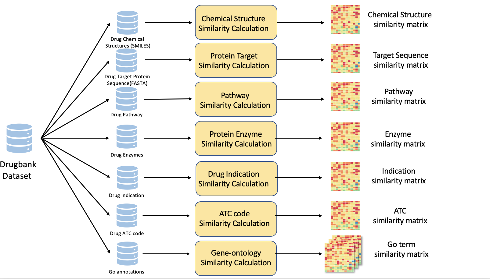

# Drug_Similarity
------------------
## 1. Introduction
This repository contains implementation code of different drug similarities computing. Currently, we have seven drug similarities include chemical, protein sequence, enzyme, indication, pathway, ATC code and GO terms similarities of 1787 approved drugs.

## 2. Pipeline


Figure1: Overall framework for the drug similarity computing.
## 3. Usage
All the drug information is from [Drugbank](https://www.drugbank.ca) dataset. 
### ATC Code Similarity 
We define the *k*th level ATC code based similarity *S_k* of drug *a* and drug *b* as      
=\frac{ATC_k(a)\cap&space;ATC_k(b)}{ATC_k(a)\cup&space;ATC_k(b)}). 

where *ATC_k* represents all ATC codes at the *k*th level. Then the similarity score *S_atc(a, b)* is defined as follows:  
=\frac{\sum\limits_{k=1}^{n}S_k(a,b)}{n}&space;). 

where *n* represents the five levels of ATC codes and ranges from *1* to *5*.   

Get ATC similarity matrix, the output is a .csv file that stores the similarity matrix.   
```sh
    $ cd ATC_similarity
    $ python ATC_similarity.py
```

### Chemical Similarity
We constructed chemical structure features based on Pubchem fingerprint and the calculate the Jaccard similarity of each pair.

Get chemical similarity matrix, the output is a .csv file that stores the similarity matrix.   
```sh
    $ cd chemical_similarity
    $ python chemical_similarity.py
```

### Enzyme Similarity
The enzymes vector is represented by a binary matrix in which elements refer to the presence or absence(presence 1, absence 0).If the enzyme that is inhibited by the drug, set the value to -1. Then we compute the TFIDF of the drugs. Based on TFIDF we compute Cosine similarity of each pair.

Get the TFIDF vector of drugs. 
```sh
    $ cd enzyme_similarity
    $ python get_enzyme_TFIDF.py
```
Get enzyme similarity matrix, the output is a .csv file that stores the similarity matrix.   
```sh
    $ python enzyme_similarity.py
```


### Indication Similarity
Same as the Enzyme similarity, we compute the Cosine similarity of TFIDF of each drug pairs.

Get the TFIDF vector of drugs. 
```sh
    $ cd indication_similarity
    $ python get_indication_TFIDF.py
```
Get enzyme similarity matrix, the output is a .csv file that stores the similarity matrix.   
```sh
    $ python indication_similarity.py
```


### Pathway Similarity
Same as the indication similarity, we compute the Cosine similarity of TFIDF of each drug pairs.

Get the TFIDF vector of drugs. 
```sh
    $ cd pathway_similarity
    $ python get_pathway_TFIDF.py
```
Get enzyme similarity matrix, the output is a .csv file that stores the similarity matrix.   
```sh
    $ python pathway_similarity.py
```


### Go term similarity
We use package [pygosemsim](https://github.com/mojaie/pygosemsim). We choose the method from Wang et al.. to compute biological processes (BPs) similarity, molecular function (MF) similarity and cellular component (CC) similarity separately.

get the drug similarity .txt file for each drug and then process the .txt file to get the similarity matrix.
```sh
    $ cd go_similarity
    $ sbatch run.sh #get the .txt file
    $ python txt_process.py #get the similarity matrix
```


### Sequence similarity
Due to the long time for the sequence similarity computing, we use package the golang code. The normalized Smith-Waterman Algorithm is used to calculate the protein sequence similarity of two drugs.  

get the drug similarity .txt file for each drug and then process the .txt file to get the similarity matrix.
```sh
    $ cd seqence_similarity
    $ sbatch run.sh #get the .txt file
    $ python txt_process.py #get the similarity matrix
```

## Results

All the drug similarity matrices can be found in this shared [OneDrive folder](https://buckeyemailosu-my.sharepoint.com/:f:/g/personal/zhang_10631_osu_edu/EtNaiTLV3OZBobXV5MHwMWEBU6tfJ-2eOvt6-4JmPIJkOw?e=ngo7WC).
